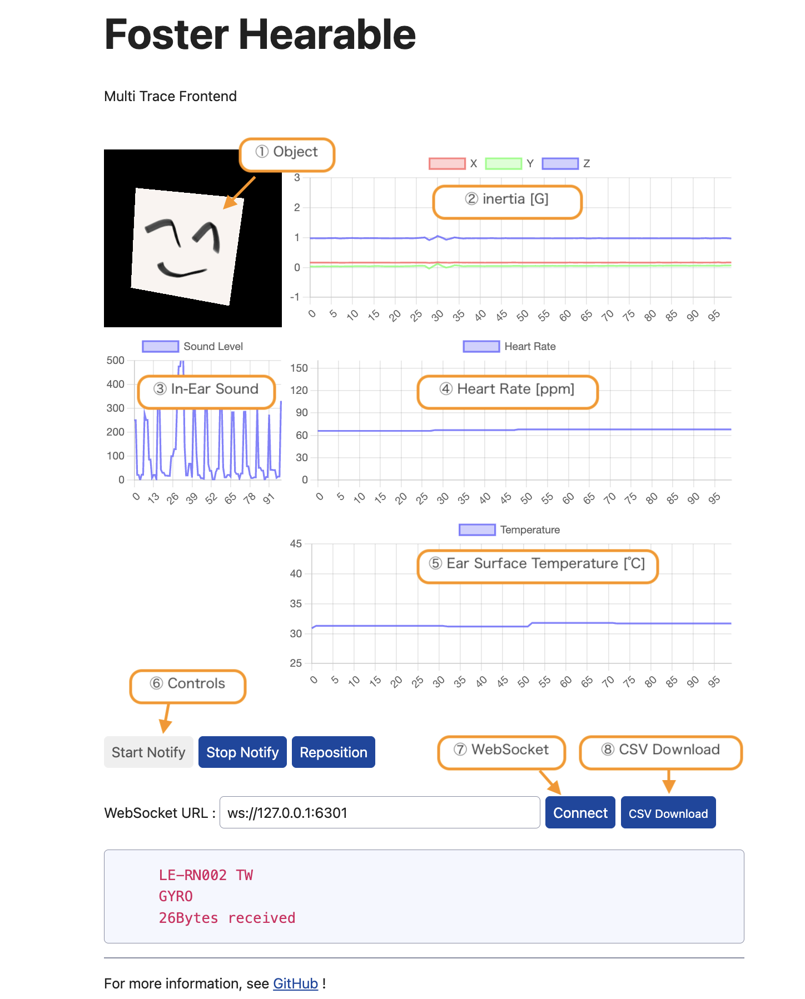

# Hearable Multi-App
---
## Overview
Hearable Multi-Appはヒアラブルデバイス（フォスター電機 RN002）に実装されているセンシング機能の取得データを表示するためのフロントエンドアプリケーションです。\
★ デモ用Webサイト [https://foster-hearable.github.io/Multi-App/](https://foster-hearable.github.io/Multi-App/)

WebBluetoothを用いてヒアラブルデバイスRN002からデータ取得を行い、各センシングデータの表示やWebSocketサーバーへのデータ送出を行います。\
WebSocketのデータはIMUの値およびフィルタにより補正した加速度、基準位置からの回転量を示す角度データで構成されているため、WebSocketサーバー側での加工や解析に用いることができます。

## 対応ブラウザ
WebBluetoothに対応したブラウザ　参考：[ブラウザー互換性一覧表 Mozilla.org](https://developer.mozilla.org/ja/docs/Web/API/Web_Bluetooth_API#ブラウザーの互換性)

#### 動作することを確認しているブラウザ
- Chrome（Windows,Mac,Android）
- Edge（Windows,Mac）
  
#### 動作しないことを確認しているブラウザ
- Safari（Mac,iOS）
- Chrome (iOS)

## 操作インターフェース

#### ① Object
ヒアラブルデバイスより送られてくるデータに合わせて回転します。
接続直後や大きく回転した直後にはフィルタによる補正が動作し、ヒアラブルデバイスが動いていない場合であっても適切な位置まで徐々に回転することがあります。

#### ② Inertia [G]
加速度センサーのXYZデータをデバイスの回転方向で補正したデータ履歴を表示します（最大100秒）
静止している状態では重力加速度（1G）がZ軸に現れ、動作している状態においては重力および慣性による加速度を表示します。

#### ③ In-Ear Sound
耳内音の音量レベルのデータ履歴を表示します（最大100秒）
この音量レベルには低域通過フィルタが適用されているため、イヤチップにより外耳道が密閉されている場合においては鼓動による音量レベルの変動が表示されます。

#### ④ Heart Rate [ppm]
ヒアラブルデバイスより送られてくるハートレートのデータ履歴を表示します（最大100秒）

#### ⑤ Ear Surface Temperature [℃]
ヒアラブルデバイスより送られてくる外耳道表面温度のデータ履歴を表示します（最大100秒）

#### ⑥ Controls
- Start Notify：クリックするとBLEデバイスの選択ウィンドウが表示されます（選択後、通知データが送られてくるまで20秒程度かかる場合があります）
- Stop Notify：ヒアラブルデバイスからのデータ通知を停止する場合にクリックします。データ通知を再開させたい場合にはブラウザをリロードしてください。
- Invert：①PPG Levelで表示する位相を反転します。メーター動作が不安定な場合にクリックしてください（データ通知停止後にはブラウザのリロードボタンに切り替わります）

#### ⑦ WebSocket
- WebSocket URL：WebSocketで接続するURLを指定してください。
- Connect：WebSocket URLとの接続/切断を行います。本ページがロードされた直後に自動的に接続を試みます。
  
#### ⑧ CSV Download
- ヒアラブルデバイスより送られてきた生体データのCSVファイルをダウンロードします
- IMUで取得したジャイロ／加速度、回転の補正を適用した加速度、回転角のそれぞれについてX軸・Y軸・Z軸の３値を記録します

## WebSocketでの拡張
WebSocketで送られてきたヒアラブルデバイスの脈波データを各種解析ツールのインプットとして用いることにより、ヒアラブルデバイスで取得した生体データを多面的な解析に利用することが可能となります。

#### WebSocketデータフォーマット
コンマ区切りで下記順序のデータ列を送出します。

|   | データ種別 | フォーマット |
|-|-|-|
| 1 | ステータス | bit7-2:使用せず、bit1:タッチ操作(1:ON、0:OFF)、bit0:装着(1:ON、0:OFF) |
| 2 | W成分 | Float値によるQuaternionのW成分データ |
| 3 | X成分 | Float値によるQuaternionのX成分データ |
| 4 | Y成分 | Float値によるQuaternionのY成分データ |
| 5 | Z成分 | Float値によるQuaternionのZ成分データ |

## 注意事項
- ヒアラブルデバイスに接続してから生体データが更新されるまで最大で20秒程度の時間がかかる場合があります。
- 左右のヒアラブルデバイスを使用している場合、状況に応じて自動的にどちらか片側のヒアラブルデバイスからのセンサー情報を取得します。\
  右または左の任意のヒアラブルデバイスからデータ取得を行いたい場合は、使用しないヒアラブルデバイスをチャージケースに収納してから接続してください。
- 動作確認されているブラウザであっても、バージョンやプラグインの状況などによってはアプリケーションが正常に動作しないことがあります。また、ブラウザまたはシステムの省エネモードなどの影響によりデータ更新タイミングが変化する場合があります。

  
※ワイヤレス通信は周囲の状況によりデータ欠落や再送・遅延が発生します。センサーデータはこれらの事象を考慮したうえでご利用ください。\
※このアプリケーションおよびヒアラブルデバイス（フォスター電機 RN002）は医療機器ではありません。医療行為には使用できません。\
※このアプリケーションはヒアラブルデバイス（フォスター電機 RN002）の評価を目的として[MITライセンス](https://github.com/foster-hearable/HeadTracker/blob/e59c1e2fe2de506fb53649f6b3cb550f1e6ca852/LICENSE.txt)の下に公開しております。
